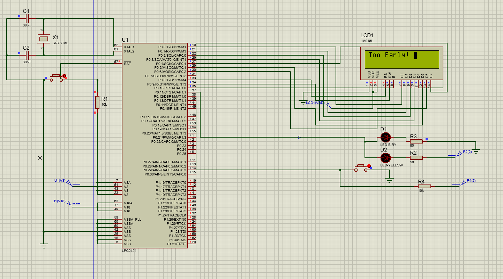

# Reaction-timer-using-ARM7

A reaction timer circuit is an electronic circuit designed to measure and display the time it takes for a person to react to a stimulus. This type of circuit is commonly used in games, psychology experiments, and cognitive testing to assess a person's reflexes and response time.

This circuit is made using ARM7  NPX model LPC2124 micro processor to check and count the reacton time in milli second of the user. 

### The project consists of 
- A proteus simulated circuit
- C code
- A generated HEX file to interface the simulated microprocessor with the C code

   
  **The project is done using Proteus and IAR Embedded Workbench**
 
  Here is the working simulated image of the project when the user interacts before the timer starts
  

   
  Here is the working simulated image of the project when the user pressed the button after a certain time delay

Tewodros Seble
 
All Rights Reserved
